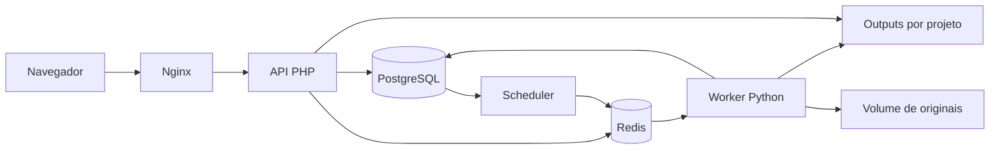

# Arquitetura

Estado conferido em 27/09/2026. Fontes: `compose.yml`, `app/public/index.php`, `app/src/`, `worker/` e `frontend/`.

## Componentes

O Nginx publica apenas a porta de loopback 8095 e encaminha requisições ao PHP 8.3. A API modular usa PostgreSQL 17 para dados e outbox, Redis 7.4 para sessões e fila, um scheduler para despachar tarefas e um worker Python 3.12 para processamento. O frontend usa JavaScript nativo e CSS local; não exige npm nem um build de assets.

## Módulos

- `app/src/bootstrap.php`: banco, fila, sessão, identificação e utilitários de resposta.
- `register.php`: cadastro livre com validação e papel comum.
- `media.php`: upload, validação, execução, cancelamento, retomada, streaming e edição de transcrição.
- `progress.php`: disponibilidade dos outputs a partir das etapas e da versão dos arquivos sincronizados.
- `outputs.php`: biblioteca global, catálogo e leitura autenticada.
- `knowledge.php`: conclusões manuais, revisão, ocultação, snapshots, exportação e inventário.
- `gemini.php`: chave por usuário, consulta de modelos e rascunho. A geração retorna 409.
- `worker/service.py`: laços de worker e scheduler; `pipeline.py`: motores de mídia; `outputs.py`: sincronização dos arquivos; `knowledge.py`: pacotes e inventário.
- `worker/gateway.py`: contrato legado de provedor, desconectado do pipeline.
- `frontend/library.js`, `outputs.js`, `progress.js` e `gemini.js`: entrada nos resultados, leitores, acompanhamento e configuração de IA.

## Fluxo e consistência

O upload envia blocos de 8 MiB, controla integridade por SHA-256 e admite retomada. A conclusão enfileira ingestão; FFprobe/FFmpeg verificam a mídia. A análise cria uma versão com cinco etapas: áudio, transcrição, frames, OCR e telas. As ferramentas são FFmpeg, faster-whisper e Tesseract.

Etapa concluída no banco não basta para liberar um documento: os arquivos precisam estar sincronizados. `worker/outputs.py` publica `.readiness.json` com as versões das etapas; o PHP compara essas versões. Assim, o arquivo de uma tentativa antiga não libera uma nova tentativa. Há compatibilidade por data para outputs anteriores ao marcador.

A revisão produz conclusões com evidências. Aprovar congela um snapshot; a exportação usa esse snapshot e inclui apenas evidências citadas pelos itens aprovados. Uma ocultação invalida aprovações e OCR da versão afetada.

## Persistência e limites

- PostgreSQL: contas, projetos, vídeos, execuções, etapas, revisões, snapshots, tarefas e configurações Gemini.
- Redis: sessões, filas e sinais de vida.
- Volume `media`: originais/uploads e segredo mestre Gemini.
- Pasta `outputs/`: derivados, textos, imagens e exportações; web em leitura, worker em escrita.
- Volume `model-cache`: pesos locais.
- `/target`: projeto-alvo montado somente para leitura; inventário não executa código.

As contas são isoladas por proprietário. A classificação antiga de sensibilidade permanece no armazenamento por compatibilidade, com padrão interno, mas saiu do formulário. Nenhuma retenção diferenciada por esses níveis foi implementada.

ai-memory é uma ferramenta de contexto dos agentes de desenvolvimento, independente da aplicação e do Gemini. Seus dados não pertencem aos volumes do VTSanalyzer.
